# Design

---

## Preparation

---

### Paper Prototypes

We created five paper prototypes to define how our app should look and feel before moving to digital prototyping. These screens map out the **core user flows** in our app, helping us focus on **clarity, simplicity, and consistency** in navigation.

* * * * *

### Paper Prototype 1: Home Page

On the **Home Page**, users are greeted personally with "Hallo Name!" at the top.

They can immediately see a clear list of their upcoming activities for today, like:

-   Grillparty (with location and time)

-   Volleyball (with location and time)

Below, there is a section called **"Deine Interessen"** so users can stay connected with their interests.

In the bottom navigation bar, there is a **"+" button** that users can tap to create a new activity whenever they want.

The navigation bar includes icons for:

-   Overview

-   Add Activity

-   Home

-   Community

-   Profile

This page is designed so that users can quickly check what's coming up, manage their interests, and add new activities easily without feeling overwhelmed.

[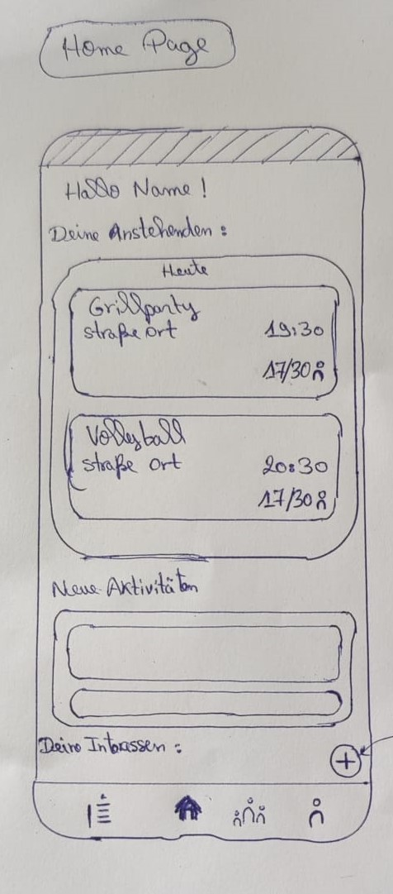](assets/images/paper_prototypes/bild_paper1.jpg)

* * * * *

### Paper Prototype 2: Create Activity Page

On the **Create Activity Page**, users can:

-   Add a **cover image** for the activity.

-   Enter the **activity's name**.

-   Select the **type of activity**, set the **time, date, and location**.

-   Adjust how many people can join with **+/- buttons**.

-   Write a **description** with more details about the activity.

-   Finally, they can publish the activity by tapping **"Veröffentlichen"**.

The layout is structured and easy to follow, so users don't forget to add important details while creating an activity.

[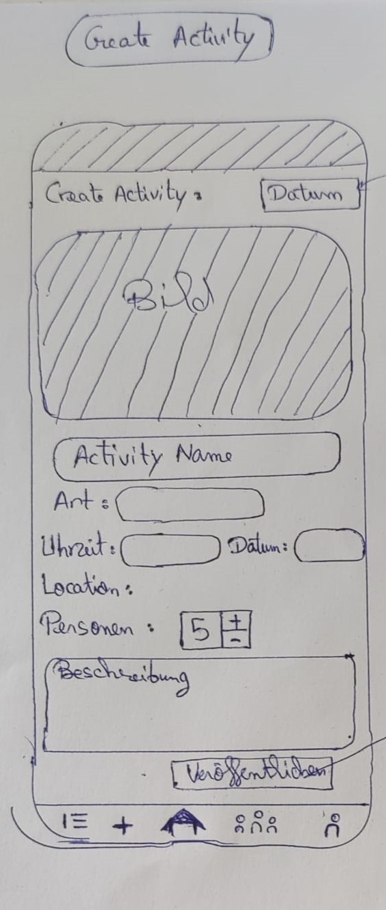](assets/images/paper_prototypes/bild_paper2.jpg)

* * * * *

### Paper Prototype 3: Activity Details View

When users tap on an activity from the home page, they are taken to the **Activity Details View**.

Here, they can see:

-   A **large cover image** for the activity.

-   The **title**, such as *Grill Party*.

-   Who organized it (e.g., *Leon Schmidt*).

-   Where it takes place (*Darmstadt*) and the date (*22/11/2025*).

-   A detailed **description** that explains what the event is about and invites them to join.

There is also a back arrow at the top so they can return to the previous screen easily.

This page helps users get a clear picture of what the activity is before deciding if they want to join.

[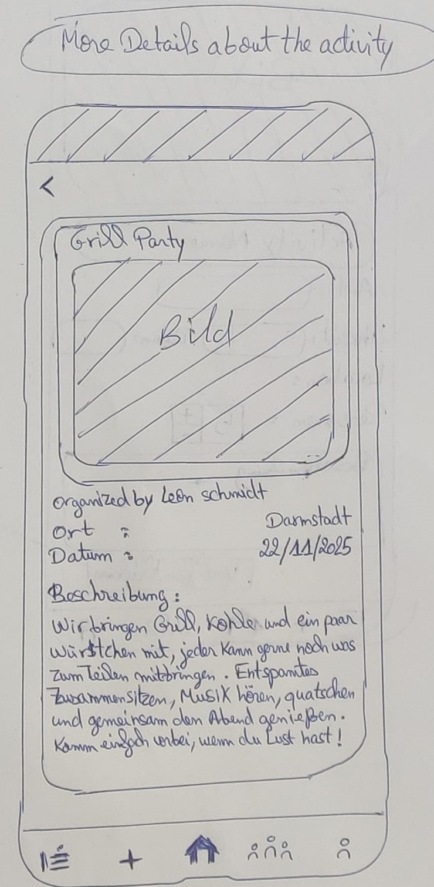](assets/images/paper_prototypes/bild_paper3.jpg)

* * * * *

### Paper Prototype 4: Community Page

The **Community Page** allows users to explore and manage their communities in the app.

At the top, there is a **search bar** for finding specific communities.

Below, users can see a **list of communities they are part of**, such as:

-   FBI

-   Sportverein

-   Wohnheim

-   Anime Meeting

-   Fachschaft

Next to each community, there is a **"Verlassen" button** so users can leave a community whenever they want.

A QR code scanner is also included for quickly joining a community.

This page keeps community management simple and accessible, making it easy to find, join, or leave groups.

[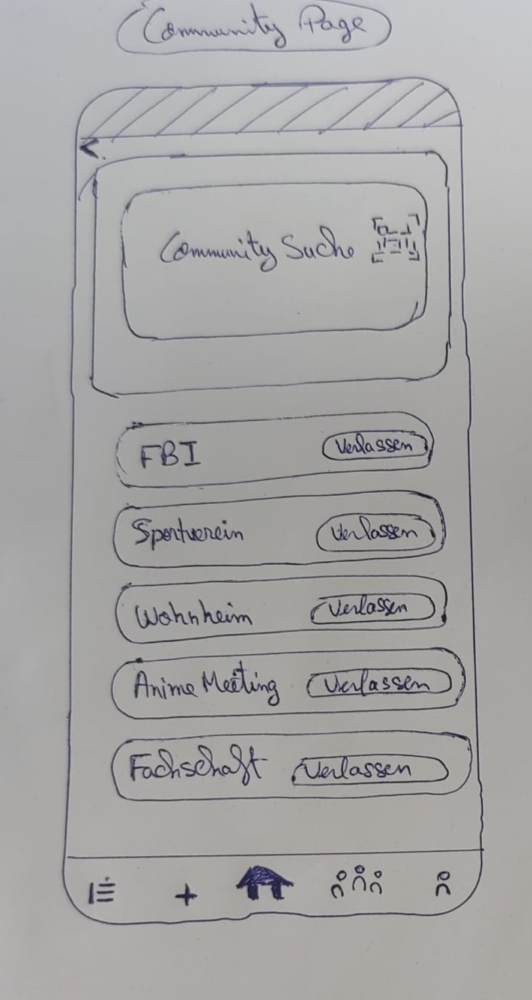](assets/images/paper_prototypes/bild_paper4.jpg)

* * * * *

### Paper Prototype 5: Profile Page

The **Profile Page** helps users manage their personal information.

At the top, users see their **name and profile icon**.

They can view and edit:

-   Email address

-   Password

-   Birthday

Each section has clear input fields and small supporting texts for guidance, along with an "X" icon to clear fields easily if needed.

A back arrow allows users to return to the previous page without hassle.

This page is designed to keep profile management clear, secure, and user-friendly.

[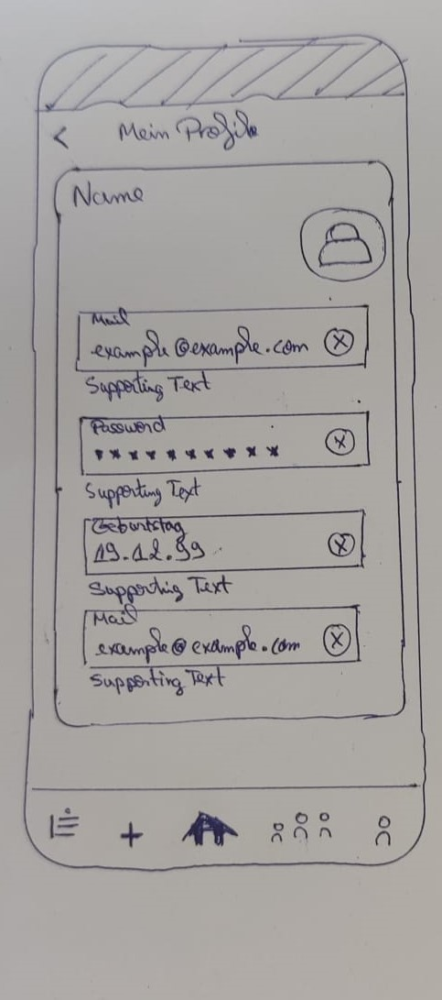](assets/images/paper_prototypes/bild_paper5.jpg)

### Fonts

#### Font Requirements

Choosing the right font was one of the most important steps in shaping the design language of our app. Since the app is aimed at university students—many of whom are deeply familiar with the visual conventions of social media platforms—we knew from the beginning that the typeface had to be modern, easy to read[^1], and feel at home in a mobile interface. To that end, we focused primarily on sans serif fonts, as they are widely used in interface design for their clean appearance and high legibility[^2] on screens. Their simplicity also complements the minimalist and friendly tone we sought to establish throughout the app.

In addition to their functional advantages, sans serif fonts carry a sense of approachability and familiarity[^3]. Most popular lifestyle and social apps use sans serif typography, which makes them feel intuitive to use. By echoing these established visual norms, we reduce friction for new users and help them feel comfortable from the first interaction. In that sense, our font choice wasn’t just an aesthetic decision—it was also a strategic step toward building trust and recognition in a competitive user environment.

Licensing and ease of integration were also important considerations. We prioritized fonts that were freely available under open licenses to ensure long-term flexibility without legal or financial constraints. This ruled out high-quality but proprietary fonts like SF Pro, as well as semi-restricted options like Red October[^4]. We focused instead on fonts that are open-source, reliable, and optimized for digital use across platforms.

#### Font Selection Process

We explored several strong contenders from Google Fonts and other open repositories. These included: Rubik, Lato, SF Pro Display and SF Pro Text, Asap, Signika, and Noto Sans.

Initially, Signika stood out. It had rounded terminals, a friendly appearance, and felt playful without being unserious—qualities that aligned well with the community-driven, peer-to-peer nature of our app. It seemed like a bold and fresh choice. However, through more extensive UI testing, we began to encounter issues with readability, especially on smaller screens. Its soft, wide shapes made text feel less crisp at small font sizes, and certain letterforms (like “a,” “e,” and “s”) lacked the clean separation needed for quick scanning in dense UIs. For college students rapidly skimming event details on the go, this posed a real UX concern.

Ultimately, we decided that Noto Sans was the stronger, more sustainable choice. Its strengths lie in clarity, neutrality, and technical precision—all while maintaining warmth and accessibility. Unlike Signika, which drew attention to itself, Noto Sans supports the content rather than competing with it. It delivers excellent legibility even at small sizes and offers a broad character set that supports internationalization, making it a future-proof choice should the app expand to new locales or scripts.

Moreover, the design of Noto Sans subtly reflects the academic tone of a student-oriented platform. It feels structured and trustworthy but never cold or rigid. This balance made it ideal for an app where clarity, approachability, and inclusivity are central design pillars.

[**Rubik**](https://fonts.google.com/specimen/Rubik)

[**Lato**](https://fonts.google.com/specimen/Lato)

[**SF Pro Display and SF Pro Text**](https://developer.apple.com/fonts/)

[**Asap**](https://fonts.google.com/specimen/Asap)

[**Signika**](https://fonts.google.com/specimen/Signika)

[**Noto Sans**](https://fonts.google.com/specimen/Noto+Sans)

#### Fonts that didn’t make the cut

At one point, we considered Red October. Its bold, retro-futurist look matched the experimental energy of our early logo drafts and gave the app a distinctive edge. However, it presented several drawbacks: readability suffered in body text due to compressed letterforms and fixed line spacing; its heavy, stylized appearance clashed with the social and inclusive tone we wanted to foster; and its limited language support made it an unsuitable candidate for long-term growth. Licensing concerns—requiring a commercial license for public use—further confirmed that Red October wouldn’t scale with our needs.

**[Red October](https://www.dafont.com/red-october.font)**

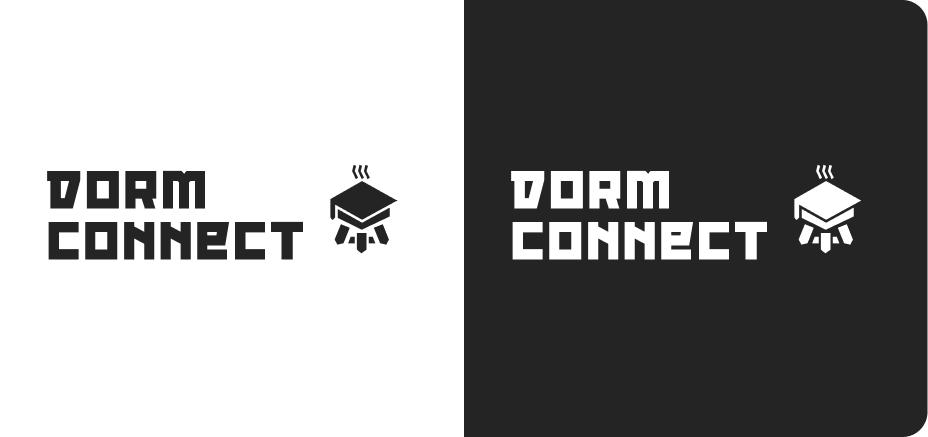

[^1]: [Mastering Mobile Typography: Font Usage Tips and Best Practices](https://www.toptal.com/designers/typography/typography-for-mobile-apps#:~:text=When%20choosing%20a%20typeface%20for%20your%20mobile%20app%2C%20your%20primary%20concern%20should%20be%20readability%2C%20which%20is%20essential%20for%20content%20consumption%2C%20accessibility%2C%20navigation%2C%20brand%20consistency%2C%20and%20reducing%20user%20errors.%20While%20readability%20plays%20an%20important%20role%20in%20the%20user%20experience%20of%20all%20digital%20products%2C%20it%20is%20paramount%20in%20mobile%20apps%2C%20where%20limited%20space%20and%20reduced%20user%20attention%20spans%20make%20quick%20and%20clear%20communication%20key.)

[^2]: [Serif Fonts vs Sans Serif](https://www.logome.ai/blogs/serif-fonts-vs-sans-serif#:~:text=Websites%20and%20Digital%20Content%3A%20Sans,apps%2C%20and%20social%20media%20content.)

[^3]: [What is the Sans Serif Invasion?](https://www.connectionmodel.com/blog/what-is-the-sans-serif-invasion#:~:text=The%20simplicity%20of%20sans%20serifs%20can%20be%20attributed%20to%20their%20clean%20and%20straightforward%20design.%20The%20lack%20of%20decorative%20strokes%2C%20known%20as%20sans%20serifs%20here%2C%20lends%20them%20a%20modern%20and%20contemporary%20aesthetic.)

[^4]: [Red October Font License](https://www.dafont.com/red-october.font#:~:text=FREE%20FOR%20PERSONAL%20USE.)

#### Final Choice

In the end, Noto Sans offered the right blend of legibility, professionalism, and quiet versatility. It scales well, feels contemporary yet neutral, and delivers a seamless reading experience in both headlines and body text. These qualities made it a perfect match for DormConnect’s vision: a tool built by and for students, with usability, clarity, and inclusiveness at its core.

---

### Color Palette

#### Vibrant Color Palette

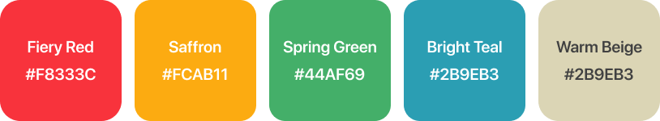

**Why we thought it would be a good fit**

At first glance, a five-hue palette of fire-engine red, golden orange , spring green, aqua blue and warm beige sells “fun, energy and variety.” Those ultra-saturated pigments are the same sort of colours children use to label party flyers or birthday banners, so they instantly communicate celebration and playfulness, exactly the vibe an event-sharing app might want to project for barbecues, karaoke nights and impromptu football games.

**Issues with this color palette**

1. Perceived age-mismatch

   Research on designing for different age groups warns that “an endless rainbow-like interface with highly saturated colours … makes for an unaesthetic and brash interface that could easily confuse and overwhelm a child,” and that the inclination toward such palettes “is mostly present in very young children.[^5] For a student-run app aimed at 18-to-25-year-olds, the scheme risks coming off as juvenile rather than collegiate and cool.

2. Visual noise next to user-uploaded photos

   Nielsen’s Aesthetic & Minimalist Design heuristic states: “Every extra unit of information in an interface competes with the relevant units … and diminishes their relative visibility.[^6] Five shouting brand colours would fight for attention with the full-colour event photos that already live on every card, slowing visual scanning and making the UI feel cluttered.

3. Breaks Material Design color hierarchy

   Google’s colour system is explicit: “In this system, you select a primary and a secondary color to represent your brand. Dark and light variants of each can then be applied to your UI in different ways.[^7] A palette with five unrelated hues exceeds those roles, making it impossible to build coherent tonal variants and state layers (hover, pressed, disabled) without confusing users.

**Conclusion**

While the rainbow palette certainly telegraphed fun, established usability heuristics and design-system guidelines argue for a tighter, purpose-driven colour scheme: one primary, one secondary and tonal variants that respect contrast ratios. Swapping the five bright hues for the calmer Coral-Red / Royal-Violet system lets us keep the sense of energy without overwhelming maturity, hierarchy or accessibility.

#### Pastel Color Palette

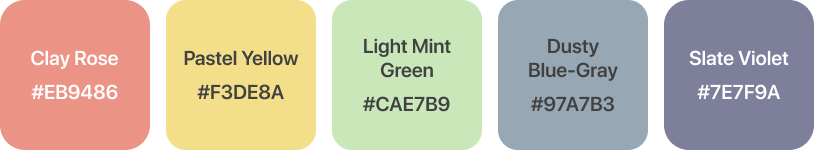

**Why we thought it would be a good fit**

The five-hue palette, Rose Clay, Honey Cream, Mint Mist, Foggy Blue, and Dusty Lilac, carries that soft, airy pastel vibe often associated with “light-hearted fun.” Mobile-UI trend pieces note that pastel schemes can “attract users just as effectively as a loud, vibrant palette … capturing a feeling of fun while remaining soothing to the eyes.[^8] That first impression makes the set feel friendly for casual, student-run events.

**Issues with the color palette**

1. Low contrast on white surfaces

   Pastels get their look by mixing a lot of white into the base hue, which dramatically lowers luminance contrast. WCAG 2.1 sets 4.5 : 1 as the minimum ratio for normal-sized text; anything paler will fail the rule and strain readers — especially against the default white screens of most phones.[^9]

2. Interactive elements fade into the background

   Usability research shows that low-contrast text “may be trendy, but it is also illegible, undiscoverable, and inaccessible,” causing users to squint and undermining clear calls-to-action.3 A pastel primary button therefore risks looking like a disabled control.

3. Colour-blind and quick-scan problems

   Accessibility guides remind us that pastel shades often sit so close in value that users with red–green or blue–yellow deficiencies (≈8 % of men) can’t distinguish them. High-contrast palettes are recommended for inclusivity; muted tones may work only “as long as contrast is preserved,” otherwise grouped data or category pills blur together.[^11]

**Conclusion**

Pastels feel welcoming, but their inherently low contrast makes it hard to meet accessibility standards and to keep critical UI elements (like “Join” buttons) visibly prominent. For an event-sharing app where photos already supply plenty of colour, a higher-contrast primary/secondary scheme (e.g., Coral Red + Royal Violet) gives clearer hierarchy while still letting the interface look fun and approachable.

#### Final Choice

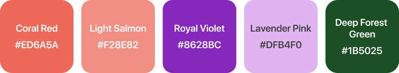

The final color palette uses just a few main colors, primarily coral red and royal violet, with a couple of supporting shades like light salmon, lavender pink, deep forest green, and pale sage. Most of the interface relies on the two main color families, which keeps the design consistent and easy to scan. By not using too many colors, the app avoids looking cluttered or overly playful, which suits the student-focused context. The palette also respects basic design principles like visual hierarchy and contrast, helping users quickly understand what’s important without being distracted.

| Hex code  | Name                     | Role in the theme                                                                                                           |
|-----------|--------------------------|-----------------------------------------------------------------------------------------------------------------------------|
| `#ED6A5A` | **Coral Red**            | One of the two primary brand colors &nbsp;·&nbsp; indicator line in the bottom-nav &nbsp;·&nbsp; default button fill        |
| `#F28E82` | **Light Salmon**   musst | Tint/accent of Coral Red — perfect for hover/pressed states, disabled buttons, or subtle accent backgrounds                 |
| `#8628BC` | **Royal Violet**         | Co-primary color &nbsp;·&nbsp; highlights attributes on Activity- and CommunityCards &nbsp;·&nbsp; category-pill background |
| `#DFB4F0` | **Lavender Pink**        | Accent of Royal Violet — ideal for chips, selection highlights, or large surface fills that need a softer tone              |
| `#1B5025` | **Deep Forest Sage**     | Positive “Join Activity” call-to-action button in the detailed activity view                                                |

[^5]: [Designing for Young Adults (Ages 18-25), page 33](https://media.nngroup.com/media/reports/free/Designing_for_Young_Adults_3rd_Edition.pdf)

[^5]: [Digital design considerations for child vs adult user groups](https://fruto.design/blog/digital-design-considerations-for-child-vs-adult-user-groups#:~:text=We%20also%20need%20to%20remember%20that%20the%20inclination%20towards%20very%20bright%2C%20saturated%20colours%20is%20mostly%20present%20in%20very%20young%20children%2C%20whereas%20older%20children%20can%20appreciate%20more%20complex%20palettes.)

[^6]: [Nielsen’s Aesthetic & Minimalist Design Heuristic](https://www.nngroup.com/articles/aesthetic-minimalist-design/)

[^7]: [Google Material Design Color System](https://m2.material.io/design/color/the-color-system.html#color-usage-and-palettes)

[^8]: [Color scheme trends in mobile app design](https://decode.agency/article/trends-in-color-schemes-for-apps/#:~:text=There%E2%80%99s%20a%20misconception%20that%20softer%20colors%20can%20be%20boring%20and%20artificial%2C%20yet%20the%20Headspace%20app%20still%20captured%20a%20feeling%20of%20fun%20in%20its%20UI%20design.)

[^9]: [WCAG 2.1 Contrast Requirements](https://www.w3.org/TR/UNDERSTANDING-WCAG20/visual-audio-contrast-contrast.html#:~:text=The%20visual%20presentation%20of%20text%20and%20images%20of%20text%20has%20a%20contrast%20ratio%20of%20at%20least%204.5%3A1)

[^10]: [Low-Contrast Text Is Not The Answer](https://www.nngroup.com/articles/low-contrast/#:~:text=When%20the%20contrast%20is%20too%20low%2C%20users%20experience%20eye%20strain%20as%20they%20try%20to%20decipher%20the%20words.)

[^11]: [Colorblind-Friendly Palettes: Why & How to Use in Design](https://venngage.com/blog/color-blind-friendly-palette/#:~:text=While%20high-contrast%20palettes%20are%20typically%20recommended%20for%20accessibility%2C%20you%20can%20also%20experiment%20with%20muted%20or%20pastel%20color%20combinations%E2%80%94as%20long%20as%20contrast%20is%20preserved.)

### Icon/Logo

#### Goal and design approach

From day one we aimed for a minimalist logo that would stay readable at home-screen size and scale up for posters or social posts. Contemporary research shows that stripped-back marks are easier to recognise, work on many screen sizes and project trustworthiness[^12] Icon-usability advice also tells us to “keep the design simple and schematic” so users can decode it at a glance.[^13]

#### Logos that didn’t make the cut

**First conecpt: grill + mortarboard**

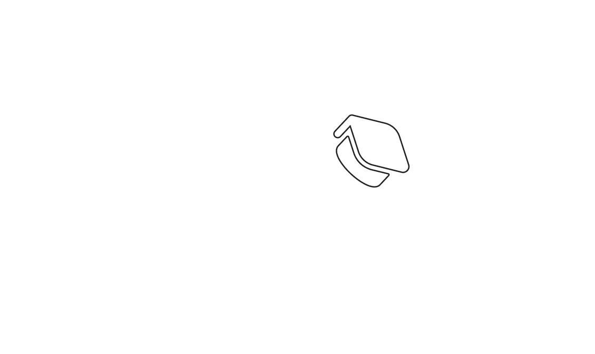

We explored three sketches that paired a barbecue grill (dorm cook-outs) with a mortarboard (students):

- **A:** Keep the grill centered and draw two flying mortarboards around it.
- **B:** Show a plain grill and rest a skewed mortarboard on the rim.
- **C:** Swap the grill's round bowl for a tilted mortarboard, keeping tripod legs and adding flames.

Although playful, the composite shapes became busy at small icon sizes and lost clarity, conflicting with small-icon guidance that warns against intricate detail.

A quick hallway test with five classmates suggested the idea nearly worked: 3 understood the “student grill-party” concept immediately, while two only did so after a hint, mainly because the grill shape wasn’t obvious at small size. The feedback confirmed the metaphor was appealing but would need cleaner lines and stronger grill cues to be reliable at icon scale.

**Second concept: camp-fire degrees with mortarboard**

The next idea turned rolled-up diplomas into camp-fire logs with a flame and side-mounted mortarboard. Visually it read as burning degrees, which risked a negative interpretation, and the crossed-scroll geometry still looked cluttered. We dropped the concept after quick peer feedback.

#### Final Choice

> Due to resizing issues, the actual logo looks slightly different in the app than in the image above.

After receiving feedback at the lab, we kept the single graduation-cap silhouette and drew nodes connected by lines that slip under the brim, hinting at students meeting through events. The mark keeps its outline even at 48x48 pixels, meeting platform icon guides that recommend strong silhouettes and limited detail for scalability.[^14] A slightly vibrant colorful gradient avoids the monotony of the contrasting network and background.

We feel the logo works in conveying the app's concept because it combines the mortarboard, which signals "student", and the network nodes, which signal "connect", neatly expressing the app's purpose.

[^12]: [The Minimalist Logo Renaissance](https://www.newtarget.com/web-insights-blog/minimalist-logo/)

[^13]: [Icon Usability](https://www.nngroup.com/articles/icon-usability/#:~:text=Keep%20the%20design%20simple%20and%20schematic.%20Reduce%20the%20amount%20of%20graphic%20details%20by%20focusing%20on%20the%20basic%20characteristics%20of%20the%20object%20rather%20than%20creating%20a%20highly%20realistic%20image%20in%20order%20to%20speed%20up%20recognition.)

[^14]: [A Comprehensive Guide to App Icon Design Essentials](https://blog.designcrowd.com/article/2186/app-icon-design-essentials)

#### Icons used in the logos

[Graduation hat icon by Fakhri Rossi on TheNounProject](https://thenounproject.com/icon/graduation-hat-5031237/)

[Graduation hat icon by Fluent](https://fluenticons.co/)

[Grill icon by Rikas Dzihab on TheNounProject](https://thenounproject.com/icon/grill-7618570/)

[Flame icon by Michael Appleford on TheNounProject](https://thenounproject.com/icon/flame-7442025/)

[Scroll icon by difatama on TheNounProject](https://thenounproject.com/icon/scroll-7731035/)

## During the Lab

---

### User Testing

We conducted **one user testing session during the lab** to evaluate navigation and usability across all paper prototypes. The user interacted with each screen by pointing with their finger and thinking aloud while performing each task.

* * * * *

### Paper Prototype 1: Home Page

The user opened the Home Page and viewed the list of upcoming activities, checking the displayed titles, times, and locations. The user then tapped the large "+" button on the Home Page to proceed to the activity creation page. Before moving on, the user also briefly looked at the navigation bar and noted the Home, Community, and Profile icons.

* * * * *

### Paper Prototype 2: Create Activity Page

The user accessed the Create Activity Page using the "+" button on the Home Page. The user entered an activity name, selected the type, and filled in the date, time, and location fields. The user used the +/- buttons to set the number of participants and wrote a short description for the activity. The user then tapped the "Veröffentlichen" button to save the activity.

* * * * *

### Paper Prototype 3: Activity Details View

The user tapped on one of the activities from the Home Page to view its details. The user read the activity's title, the organizer's name, the location, the date, and the description. After reviewing the information, the user used the back arrow to return to the Home Page.

* * * * *

### Paper Prototype 4: Community Page

The user navigated to the Community Page using the navigation bar. The user used the search bar to look for a community and scrolled through the list of joined communities. The user tapped the "Verlassen" button to simulate leaving a community and also looked at the QR code scanner on the page.

* * * * *

### Paper Prototype 5: Profile Page

The user opened the Profile Page using the navigation bar. The user viewed the email, password, and birthday fields, tapping on the fields to simulate editing them. The user also tapped the "X" button to clear a field and used the back arrow to return to the previous page.

### User Testing Results

After testing our paper prototypes with the user, we gathered insights into what worked well and where we could make improvements before taking the next steps.

### Paper Prototype 1: Home Page

The user found the Home Page clear and easy to navigate. However, the large "+" button felt distracting and took up too much space.\
**We decided to move the "+" button into the navigation bar to keep the Home Page clean while ensuring the feature remains easily accessible.**

### Paper Prototype 2: Create Activity Page

The user was able to create an activity easily. The fields, layout, and flow were clear, allowing the user to complete the task without confusion.

### Paper Prototype 3: Activity Details View

The user found the details page clear and well-structured, with all important information (title, organizer, location, date, description) easy to read at a glance, and navigation back worked without issues.

However, the user mentioned that **having a "Join" button directly on this page would make it easier to confirm participation immediately after checking the activity details**, instead of having to navigate elsewhere to join.

### Paper Prototype 4: Community Page

The user found the Community Page easy to navigate. They understood how to search for communities, view joined groups, leave a group, and use the QR code scanner.

### Paper Prototype 5: Profile Page

The user found the Profile Page intuitive and straightforward. Editing and clearing fields worked as expected, and navigation felt smooth.

## After the Lab

---

### User Navigation Diagram

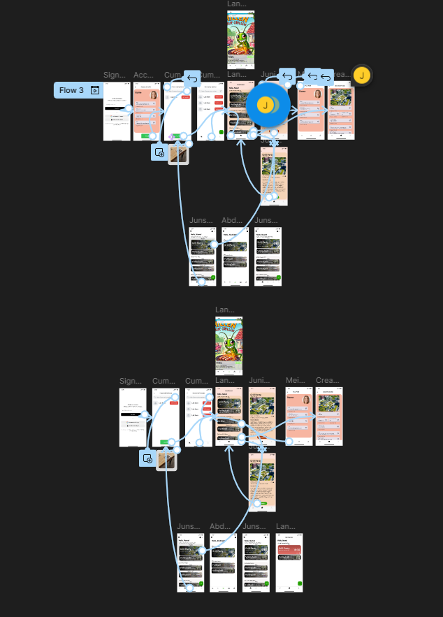

### Data Flow Diagram

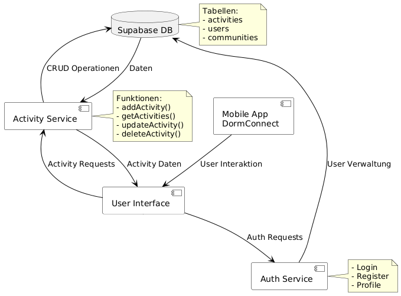

### Reflection

The process of choosing the font wasn’t entirely straightforward. We found ourselves going back and forth between font selection and logo design, making sure both elements felt like they belonged together. In the end, that back-and-forth helped us build a more consistent and well-thought-out visual identity that feels natural for our audience.

We would've liked to try out the 2 non-heuristic-conforming color palettes on test groups and see how they felt about them.