# Implementation

## Class Diagram

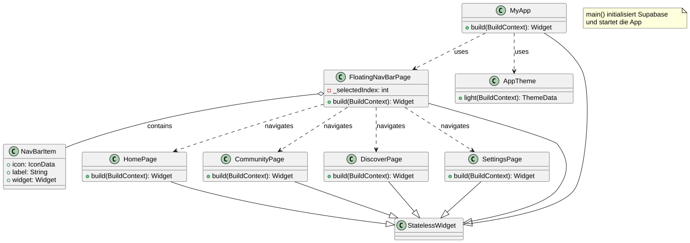

## App Highlights

### Home Page
The homepage is the first thing the user sees when opening the app. At the very top, it displays the number of activities and the next upcoming activity, which is featured with a large image. The second section below shows the upcoming activities as a horizontal list; with "See all," the list can also be displayed more compactly in a vertical view. Below that, the user finds their saved activities. At the very bottom, there is a list of past activities in case the user wants to find them again. 
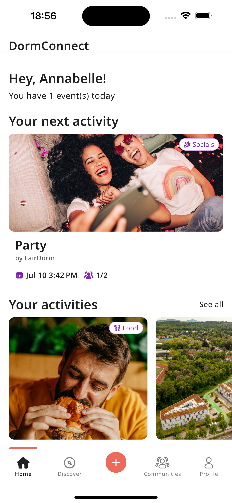
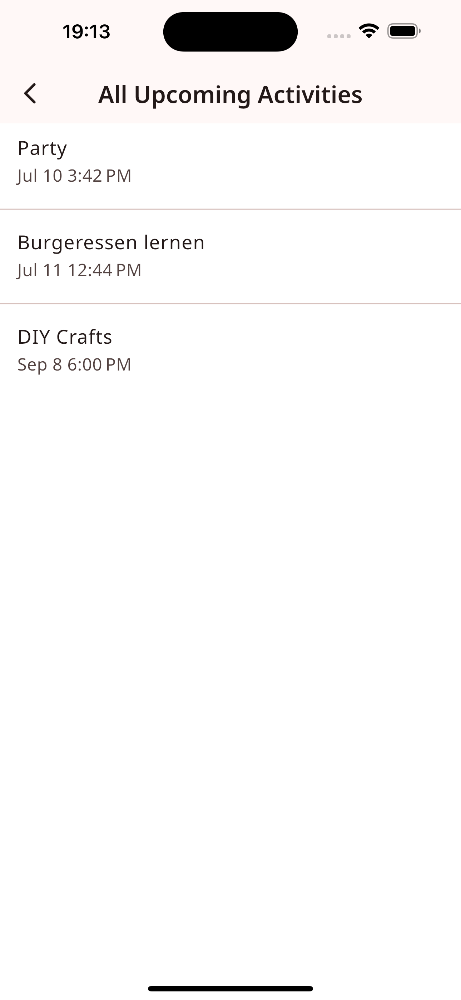

#### Activity Card

ActivityCard is the main visual element of the entity Activity with which the user can interact. It provides 5 of the most important attributes of an Activity at first glance, namely: title of the activity, community it's being hosted in, the start date of the activity, the number of participants & max participants, and the category it's listed under. ActivityCard receives its data from thetable 'activities' in the database. This data is first mapped on the entity class 'Activity' and then passed down to ActivityCard through HomePage.

**Extended view of ActivityCard**

When the user clicks on an ActivityCard, a slide-in animation is triggered from the right which renders a full-screen page containing more information about the activity, namely location and description. The image representing the activity is displayed in a bigger resolution and is fixed to SliverAppBar. The content of the page includes: The title of the activity in bold, the interactive name of the community from which this activity is being hosted, a box containing the three attributes: start date, location, and number of participants, and the description of the activity. Two floating action buttons are visible on the bottom of this page, namely "Join/Leave Activity", with the colors "Deep Forest Green" and "Coral Red" from the app's palette, and "Save", which employs the primary key as a border of a white-filled container. The former is conditionally displayed whether the user has already joined the activity or not. The second saves the ActivityCard to the "Saved activities" list. Both of these actions trigger ActivityToast. 
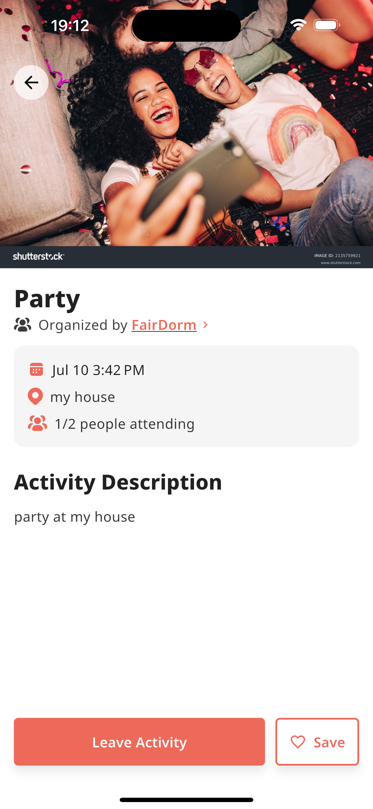
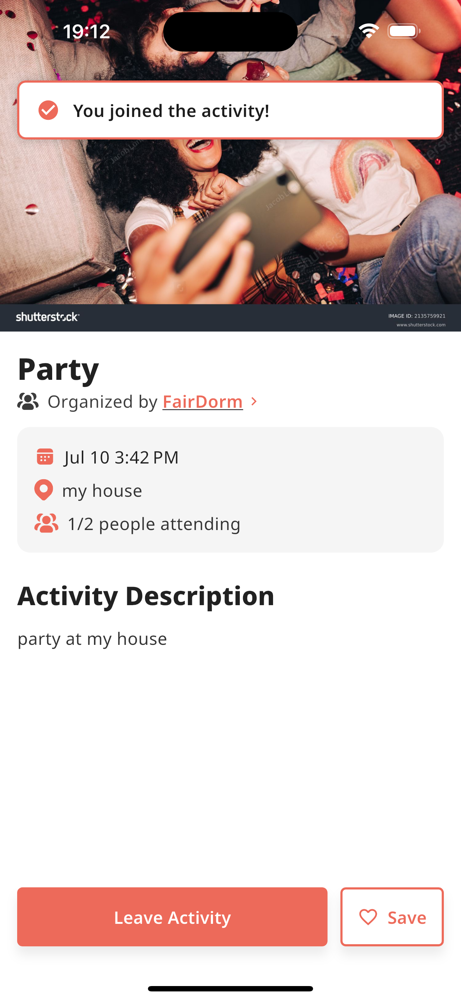
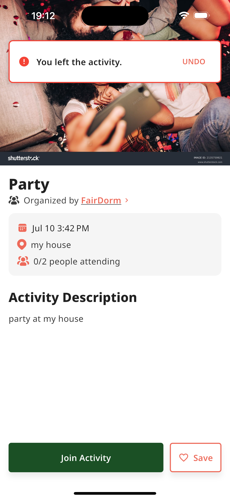

### Discover Page

On the Discover page, users can browse activities from communities they belong to, as well as activities from communities they haven’t joined yet. This keeps joined and unjoined activities clearly separated. New activities are presented in a chronological vertical list. 

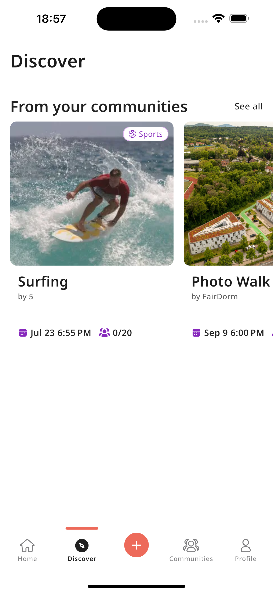

### Communities Page

The Community page consists of two sections, separated by a segmented button: the Explore tab and the Joined tab. On the Explore tab, new communities that the user can join are presented. Under Joined, the user can see the communities they are already a member of. The list view can be searched using the magnifying glass icon at the top right. Originally, next to the magnifying glass, there was supposed to be a QR code button allowing the user to join a community via QR code; however, this feature was removed due to time constraints. 

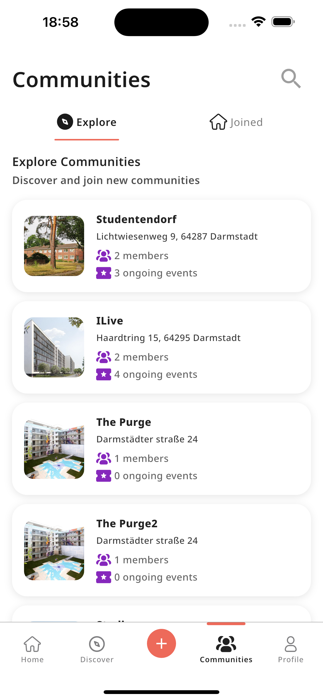
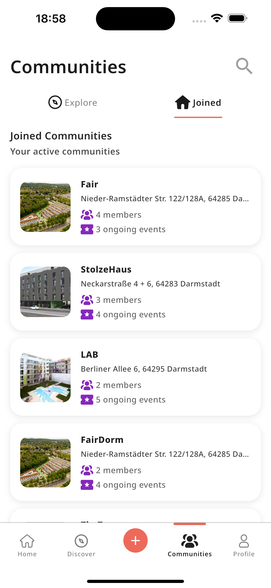

#### CommunityCard

CommunityCard is the main visual element of the entity Community with which the user can interact. It provides 4 of the most important attributes of a Community at first glance, namely: the name of the community, its location, the number of current members, and the number of ongoing activities. CommunityCard receives its data from the table ‘communities’ in the database. This data is first mapped on the entity class Community and then passed down to CommunityCard through CommunitiesPage.

**Extended view of CommunityCard**

When the user clicks on a CommunityCard, the extended view of the card pops up. The community image in the CommunityCard is a Hero which expands to a bigger resolution to be the fixed image in the SliverAppBar in the new page. The contents of the page themselves fade in into view. Alongside the name of the community in bold, the screen has a box containing the three attributes already shown in the community card.

#### Search Function

The search function displays all matching results. When updating the results, a transition animation is used to make the redraw smoother. We also added a small bounce effect, causing the search results to appear only after a 300-millisecond delay. This delay is just enough to avoid stressing the user during input, while still feeling responsive. 
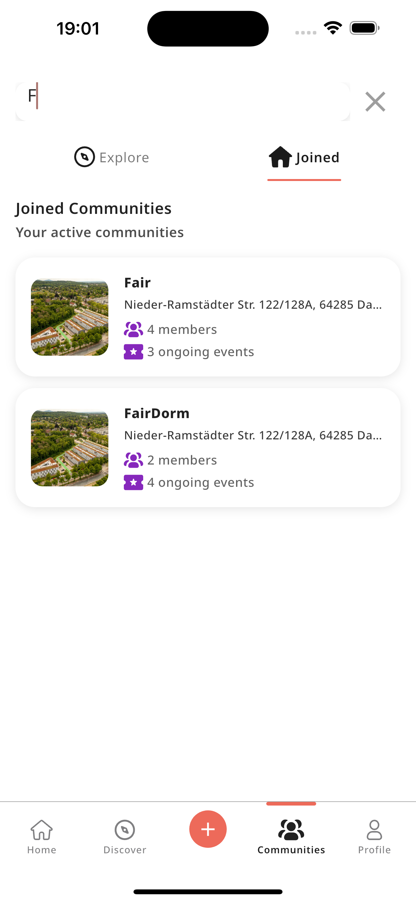

### Create Sheet

Known in the app as HybridCreateSheet.

HybridCreateSheet is a pop-up that shows when the user presses the plus (+) button in the navigation bar. It slides up with a smooth animation so the user can see that a new action has started. The user can create either an activity or a community by choosing the tab at the top.

When the user presses on "Create", an ActivityToast is triggered and notifies the user that the creation was successful.

The Create Sheet helps the user add new activities or communities easily without leaving the current page. The step-by-step structure keeps the process clear and simple, while the animations and confirmation messages make the app feel modern and easy to use.

#### Activity

The following fields are for creating an activity, so the user enters:
-  Title
-  Image URL
-  Description of the activity
-  Location of the activity
-  Category

#### Community

The following fields are for creating a community, so the user enters:
-  Name of the community
-  Image URL
-  Location of the community

### Profile Page

The ProfilePage shows the user’s profile in the app. The user can see their profile picture, username, and a button to edit the profile. On this page, the user can change a few settings: notifications, theme, and language. The user can also change their username and profile picture by clicking the Edit Profile button, which opens the phone’s gallery to select a new picture. When the user clicks Edit Profile, a small animation shows that the page is now in edit mode, keeping the app clean and easy to use. When the user clicks on notifications, theme, or language, a small window opens on the right to change the setting without leaving the ProfilePage. There is also a Logout button at the top right, so the user can log out easily.
Currently, these settings (notifications, theme, and language) are not functional, as we did not have enough time to implement the logic. We added the design and interaction, but they do not change the app settings yet. 
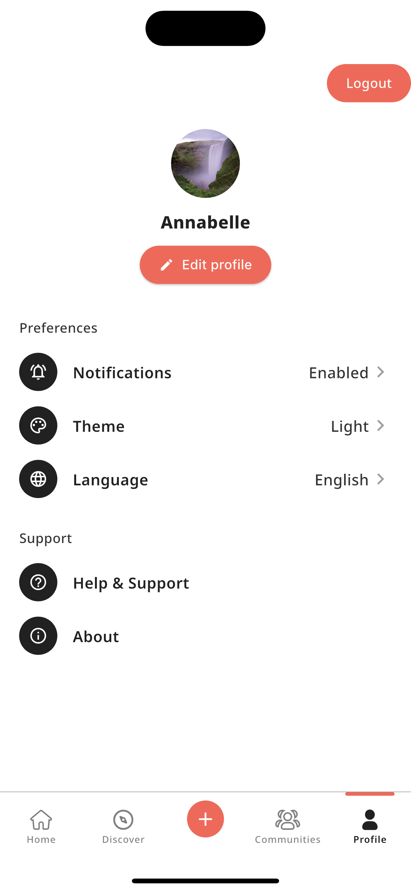

### Miscellaneous

#### Navigation Bar

Our navigation bar simplifies multitasking and navigation within the app and consists of five elements arranged from left to right: Home, Discover, Create, Communities, and Profile. The Create button is a special button that allows the user to create either an activity or a community from any screen. When clicked, the Create sheet appears. 
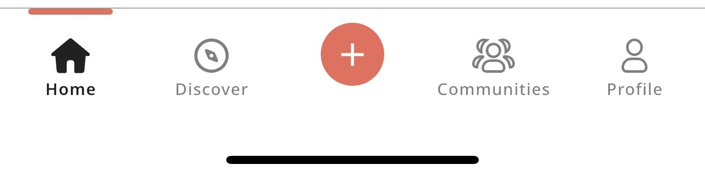

#### Toast Notification

Also referred to as ActivityToast, this design element provides the user with feedback when he has taken an action in the app. Here are the following actions that trigger ActivityToast:

    1. Joining and leaving an activity
    2. Joining and leaving a community
    3. Saving an activity

ActivityToast slides in smoothly from the top of the screen when an action is triggered and slides back out after a certain period of time has passed. Its container is white and has a border with the primary color "Coral Red".

# Brief reflection

Implementing the app was fun, but the time management could be improved. It’s challenging when you see all the possible improvements for the app and then have to switch to documentation. We tried several times to work on the documentation, but ended up going back to implementing the app.

1. FilterChip

    We would've liked to implement filtering for the activities on the discover page FilterChips. These chips would use the same items as the existing activity categories in the app. This would make looking for activities matching specific criteria more convenient for the user.

2. QR code functionality

    As mentioned in the communities page header, we would've liked to provide the user with the ability to join a community by scanning a unique QR code generated for each community. This would make the process of joining communities more convenient. Alongside having this be a button next to the search function on the community page, we would also provide the ability to scan a QR code on the onboarding page.

3. Onboarding page

    We would've liked to design a better register/sign-in page that adhered to the design language of the rest of the app. We would've incorporated the primary colors of the app, incorporated the same visual style, and also provided a brief, skippable tutorial to explain how the app works.

4. Activity-specific tags

    We would've liked to expand on the concept of "categories" by allowing for even more specific filtering of events and possibly communities. These would provide the needed context for an event that cannot be merely communicated by the category.

5. More lists in the discover page

    As it currently stands, we only have one list in the discover page. We'd originally had 3 lists in total in mind, namely: "From your communities", "Popular around you", and "Currently trending". Implementing the working functionalities for these lists would've taken much more time but would've ultimately made the discover page look more appealing.

6. Edge case handling for CRUD operations

    We would've liked to cover the edge cases of entering, leaving, or deleting activities and communities and to consider the side effects those operations would have on the other database table.

8. Functionalities on the profile page

    We would've liked to implement the accessibility functionalities on the profile page, such as dark mode, which is essentially already configured in the app since the theme/colors.dart file defines the colors for both themes but did not have time to test, and the use of locales to support other languages than English.

9. Showing events in the extended view of a community

    We would've liked to tie the models Activity and Community even closer together and allow the user to see all the events currently hosted by a community in its extended screen page. This would eliminate the need for community-specific filtering in the discover page.

11. Showing a list of participants in the extended view of an activity

    We would've liked to add an expandable list of participants, through which the user can scroll to see whether their friends are taking part in the activity too. This would naturally also require that the user consent to appearing in these lists in the settings.

12. In-app notifications for new events or event changes

    We would've liked to implement an in-app notification feature that let the user know about new activity postings in his communities or, if we'd implemented activity modification, to notify the user about what changes were made to the activity he's already signed up for.